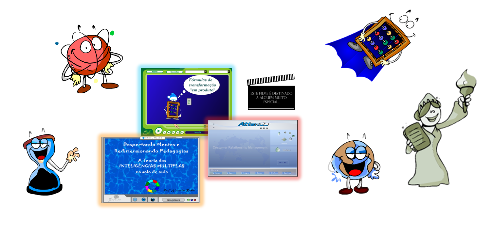

# 📗 | Multimedia Flash Projects from the early 2000s

                                                              
  

  

These are projects that I developed in the late 90s/ early 2000s using the Macromedia Suite.

Some of the projects were created in my first paid job in a school that decided to make their classes more playful. Others were freelance jobs. These were times when computers were a mystic device in Brazil and Flash Animations were considered wizardry compared to PowerPoint 98 slides.

Thanks to Flash, I could learn ActionScript -- my first programing language.

It may look silly nowadays, but it took a lot of effort and inspiration in those times to build animations with an AMD 800 MHz Athlon, an old trackball mouse, dialed internet, and a 15'' CRT display. Anyway, it felt amazing exploring all the resources provided in the Flash tool! Thank you Macromedia team, wherever you might be.

Have fun! 🎉

Ps.: _If you have a windows machine you can watch the .exe files or use the players available in this repo (flashplayer_32_sa_debug.exe) to watch the SWF files._
